## Daftar Isi

- [Persiapan Environment](#persiapan-environment)
  - [Instalasi MinGW](#instalasi-mingw)
  - [Setting PATH Environment Variable](#setting-path-environment-variable)
  - [Instalasi Microsoft Visual Studio Code](#instalasi-microsoft-visual-studio-code)

# Persiapan Environment

Sebelum memulai praktikum, pastikan kalian sudah menyiapkan environment untuk pemrograman bahasa C. Berikut adalah beberapa hal yang perlu diperhatikan:

- Instalasi compiler C (contoh: MinGW untuk Windows)
- Pengaturan PATH environment variable agar compiler dapat diakses dari command line
- Instalasi text editor atau IDE (rekomendasi: Microsoft Visual Studio Code)

Modul ini akan membahas langkah-langkah untuk menyiapkan environment tersebut agar kalian dapat mulai menulis dan menjalankan program C dengan lancar.

## Instalasi MinGW

Buka browser, kemudian buka website [MSYS2](https://www.msys2.org/).

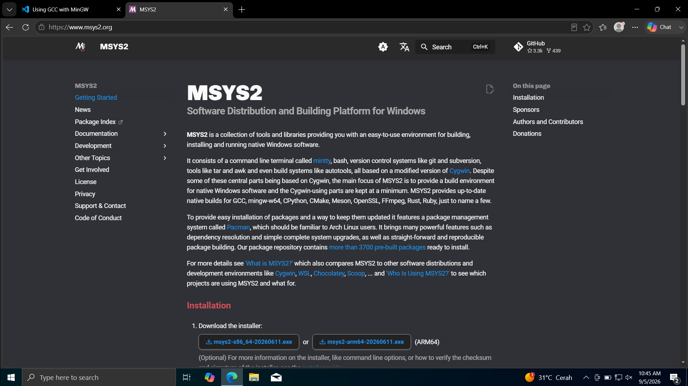

Kemudian download untuk **x86_64** pada *link* yang ada pada halaman website.

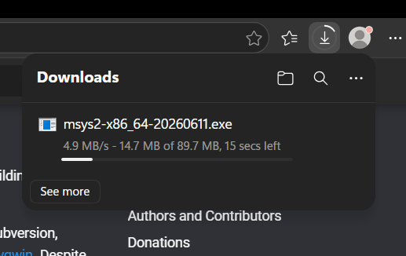

Jika sudah terunduh, buka file **.exe** nya, kemudian lakukan instalasi seperti biasa. Cukup klik **Next** hingga akhir untuk memulai instalasi, dan tunggu hingga selesai.

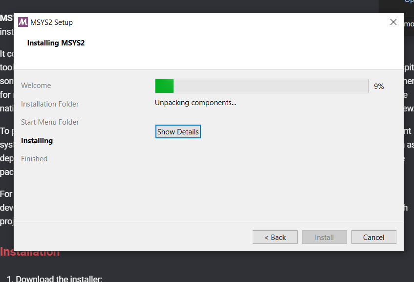

Jika sudah selesai, centang **Run MSYS2 now** dan klik **Finish**.

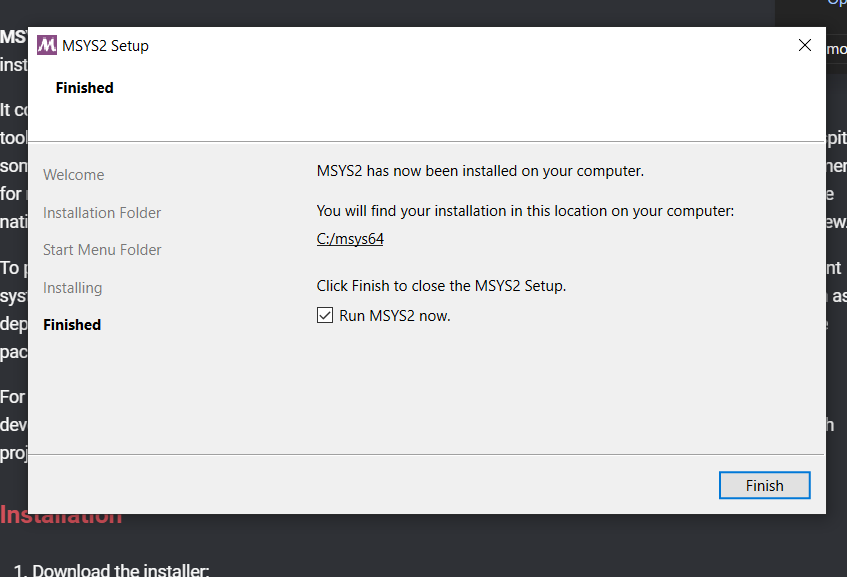

Sebuah jendela **Terminal** akan muncul.

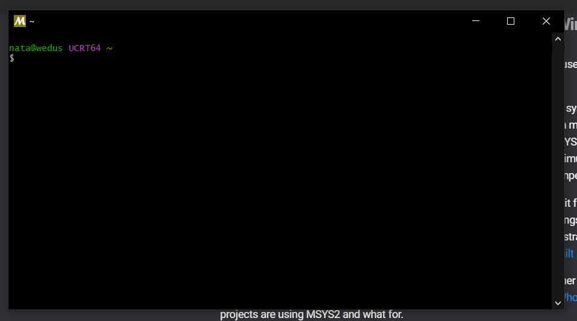

Di situ, masukkan perintah seperti ini (cukup *copy-paste*) saja, lalu Enter:

```bash
pacman -S --needed base-devel mingw-w64-ucrt-x86_64-toolchain
```

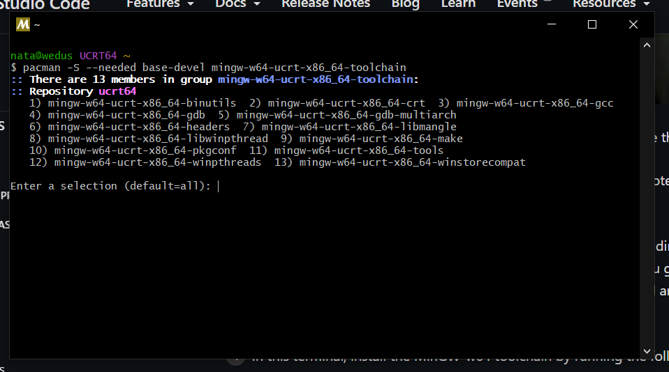

Langsung klik Enter saja, kemudian masukkan **Y**, lalu Enter lagi.

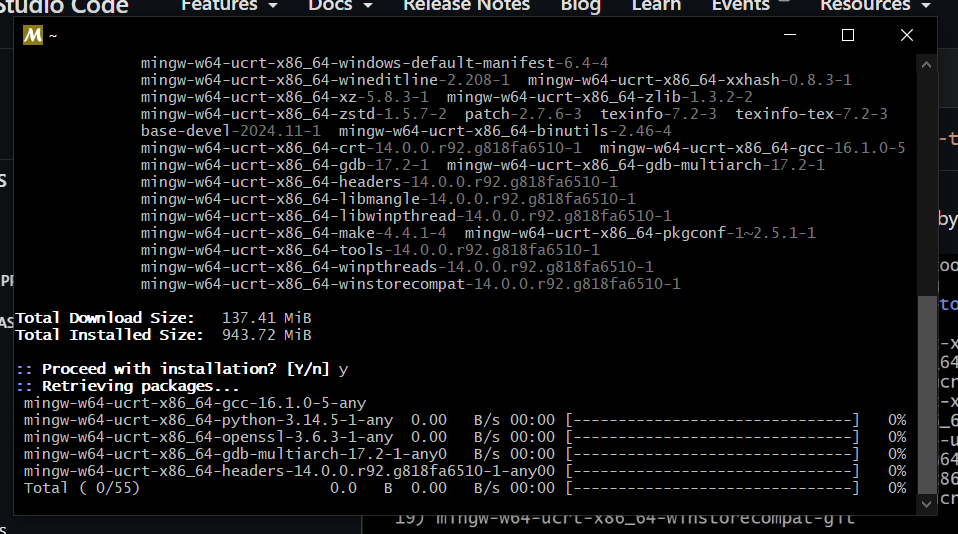

Tunggu hingga selesai. Jika sudah, kalian bisa cek apakah berhasil terinstall apa belum, dengan mengetikkan:

```bash
gcc --version
```

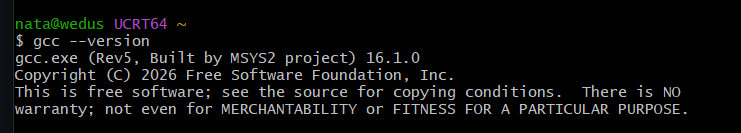

Jika sudah seperti di atas, maka MinGW dan compiler berhasil terinstall.

## Setting PATH Environment Variable

Buka Start -> cari "environment variable".

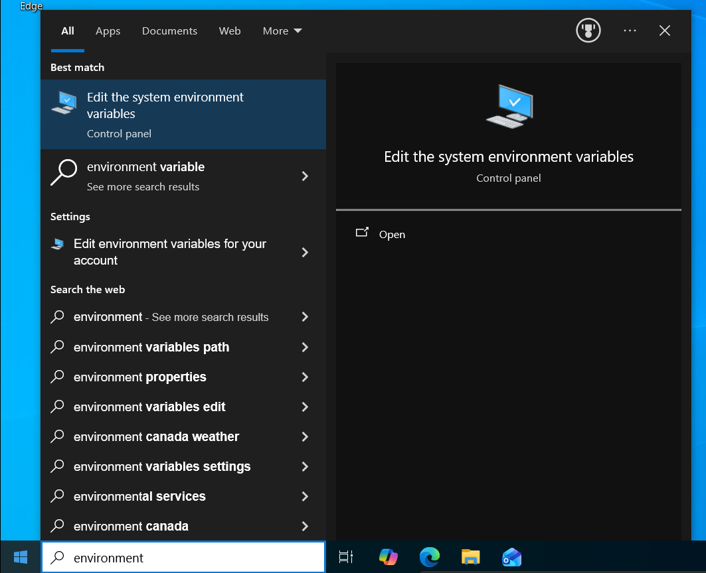

Kemudian, klik **Environment Variables**.

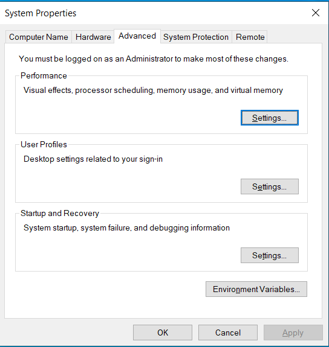

Akan muncul tampilan seperti ini. Klik dua kali pada **Path** yang berada di **System variables**.

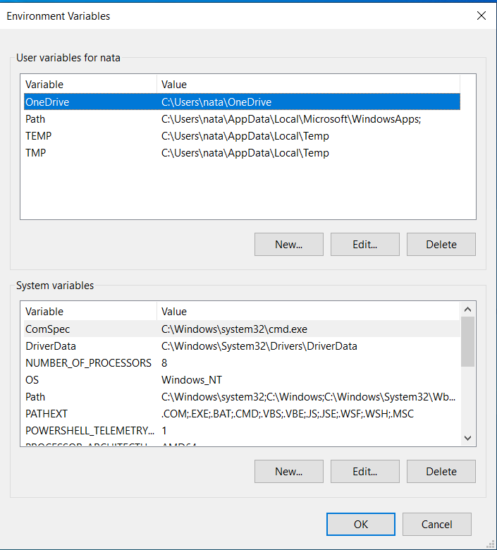

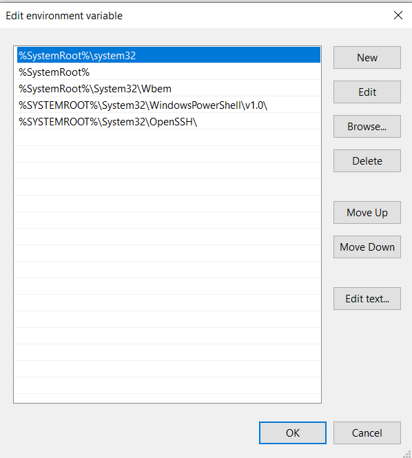

Klik **New**, dan masukkan path berikut pada kolom baru:

```bash
C:\msys64\ucrt64\bin
```

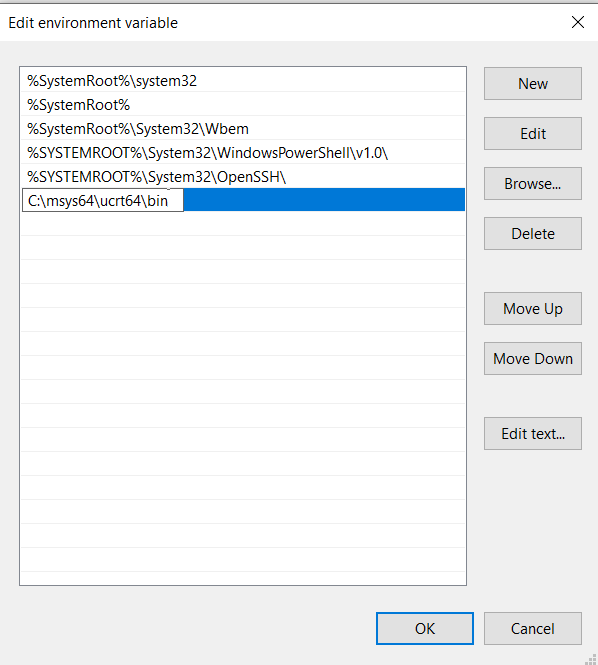

Klik OK hingga semua jendela tertutup.

Sekarang compiler sudah bisa diakses oleh Windows. Untuk mengujinya bisa melalui Windows Powershell.

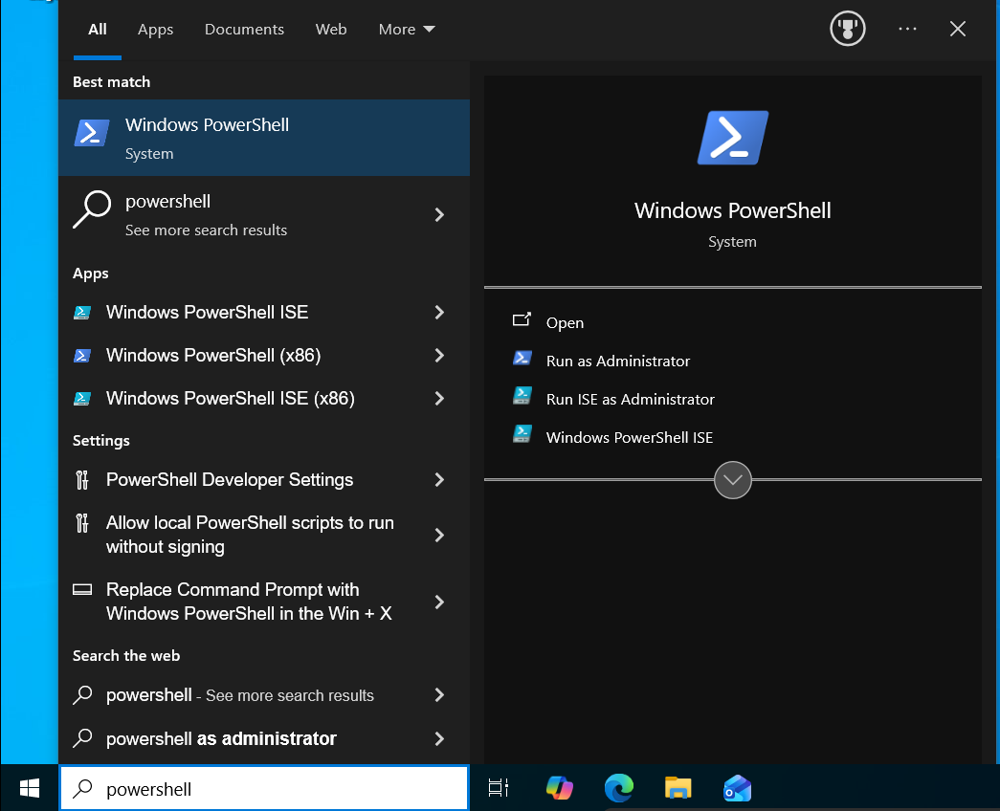

Kemudian ketik:

```bash
gcc --version
```

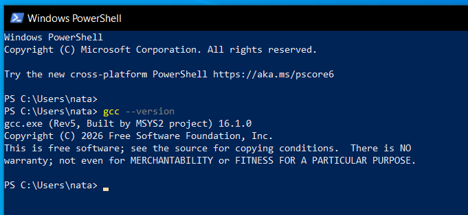

## Instalasi Microsoft Visual Studio Code

[WIP]
